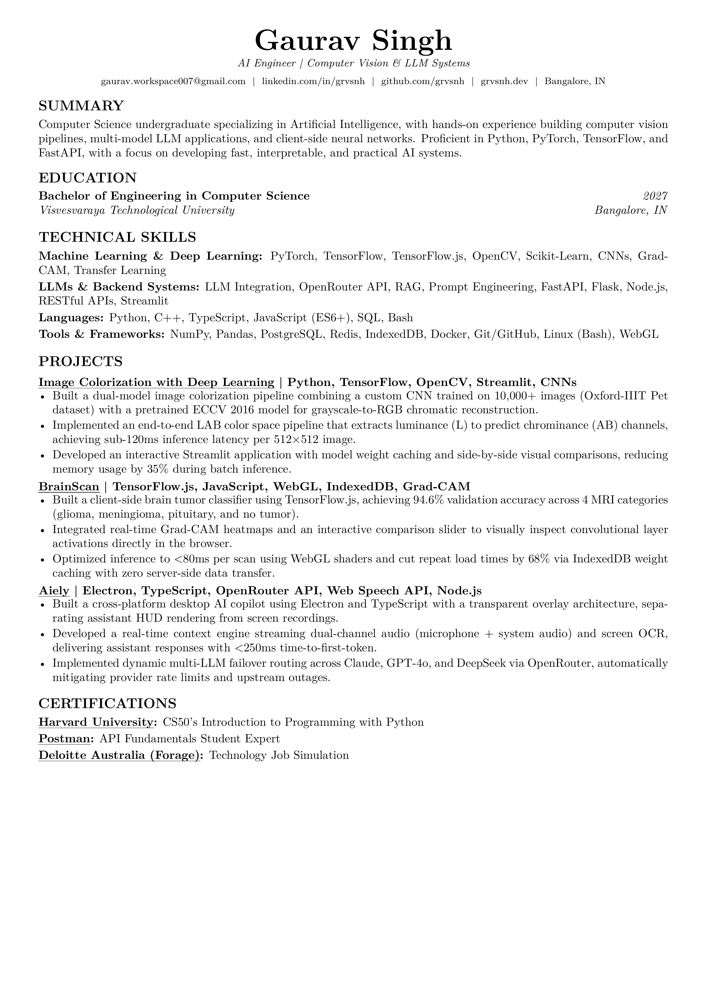

# Resume - LaTeX & CI/CD

A modular, ATS-optimized single-page resume built with LaTeX and powered by GitHub Actions. Every push automatically compiles the document into a high-resolution PDF, generates a preview image, and publishes a new versioned GitHub Release.

---

## 📄 Resume Preview

<p align="center">
  <a href="https://github.com/grvsnh/Resume-Latex/releases/latest/download/gaurav-singh.pdf">
    
  </a>
</p>

<p align="center">
  <a href="https://github.com/grvsnh/Resume-Latex/releases/latest/download/gaurav-singh.pdf">
    <b>📥 Download Latest PDF (gaurav-singh.pdf)</b>
  </a>
  &nbsp;•&nbsp;
  <a href="https://github.com/grvsnh/Resume-Latex/releases">
    <b>📦 Browse All Historical Releases</b>
  </a>
</p>

---

## 📁 Repository Structure

```
├── .github/workflows/
│   └── build-resume.yml        # CI/CD: compiles LaTeX, updates preview image, creates release
├── cv_template.cls             # Custom ATS-friendly LaTeX resume class & styling
├── resume.tex                  # Main resume entry point & section layout
├── resume-preview.png          # High-resolution rendered preview of the latest build
├── links/                      # Contact and social profile links
│   ├── email.tex
│   ├── github.tex
│   ├── linkedin.tex
│   ├── location.tex
│   ├── phone.tex
│   └── website.tex
└── sections/                   # Modular resume content
    ├── certifications.tex      # Certifications with clickable company links
    ├── education.tex           # Academic degrees & institutions
    ├── summary.tex             # Executive summary (optional)
    ├── experience/             # Work & internship experiences
    │   └── 01-internship.tex
    ├── projects/               # Individual modular project descriptions
    │   ├── Aiely.tex
    │   ├── BrainScan.tex
    │   ├── f1-stratergy.tex
    │   ├── PhotoBooth.tex
    │   └── ...
    └── skills/                 # Categorized technical skill sets
        ├── ai-ml-skills.tex
        ├── back-end-skills.tex
        ├── database-skills.tex
        ├── front-end-skills.tex
        ├── languages-skills.tex
        └── os-skills.tex
```

---

## 🚀 How to Use & Customize This Template

You do not need to install LaTeX locally to use this template—GitHub Actions will compile everything in the cloud whenever you push changes.

### Step 1: Fork or Clone
Fork this repository to your GitHub account or clone it locally:
```bash
git clone https://github.com/<your-username>/Resume-Latex.git
cd Resume-Latex
```

### Step 2: Set Your Profile & Contact Details
Navigate to the `links/` folder and replace the contents of each file with your own info:
* `links/email.tex` — Your email address
* `links/github.tex` — Your GitHub username
* `links/linkedin.tex` — Your LinkedIn handle
* `links/website.tex` — Your portfolio / personal site domain
* `links/location.tex` — Your city / region
* `links/phone.tex` — Your phone number (leave empty if not needed)

In `resume.tex`, update your candidate name:
```latex
\name{Your Full Name}
```

### Step 3: Edit Your Skills & Content
* **Technical Skills:** Edit the files under `sections/skills/` to list your languages, frameworks, databases, and developer tools.
* **Projects:** Add or edit `.tex` files in `sections/projects/`. Use the `cvproject` environment with subtle underlines on project titles:
  ```latex
  \begin{cvproject}{\href{https://github.com/username/project-name}{\uline{Project Name}} | Tech Stack}{}
      \item Key accomplishment or feature description.
      \item Another impactful bullet point with quantified metrics.
  \end{cvproject}
  ```
* **Work Experience:** Add or modify `.tex` files in `sections/experience/` using `cventry`:
  ```latex
  \begin{cventry}{Role Title}{Company Name}{Location}{Start Date -- End Date}
      \item Key responsibility or achievement.
  \end{cventry}
  ```
* **Certifications:** Update `sections/certifications.tex` with your credentials and clickable issuing organization links:
  ```latex
  \cvskill{\href{https://credential-url}{\uline{Organization}}}{Certificate Title}
  ```
* **Education:** Update `sections/education.tex` with your university, degree, and graduation year:
  ```latex
  \cventrysimple{Degree Name}{University / Institution}{Location}{Year}
  ```

### Step 4: Assemble Your Resume in `resume.tex`
Include or exclude whichever sections and project files you want rendered using `\import`:
```latex
\begin{cvsection}{Projects}
    \import{sections/projects/}{ProjectOne.tex}
    \import{sections/projects/}{ProjectTwo.tex}
\end{cvsection}
```

### Step 5: Push and Build
Commit and push your changes to GitHub:
```bash
git add .
git commit -m "Update resume content"
git push origin main
```

GitHub Actions will automatically:
1. Compile your LaTeX document to `gaurav-singh.pdf` (or your configured PDF name).
2. Render a 300 DPI preview image (`resume-preview.png`) and update the README.
3. Publish a new numbered GitHub Release (`v1`, `v2`, `v3`, ...) with the compiled PDF attached.
